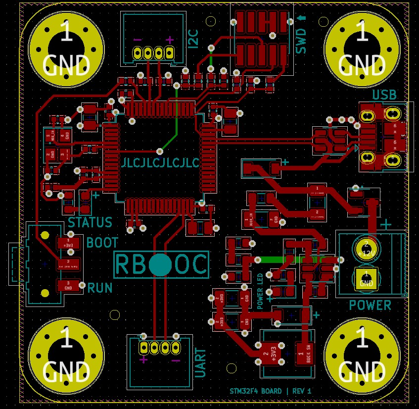
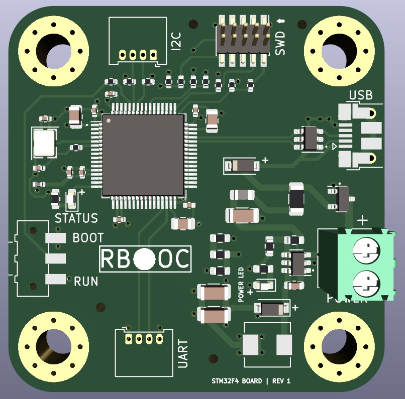
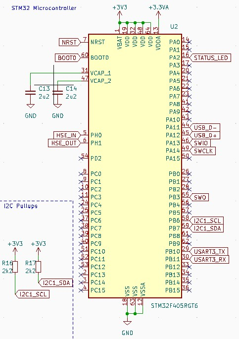
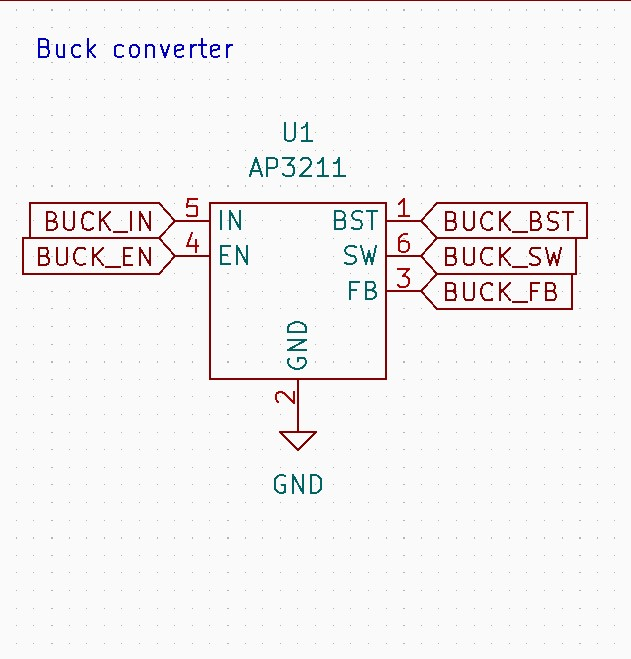
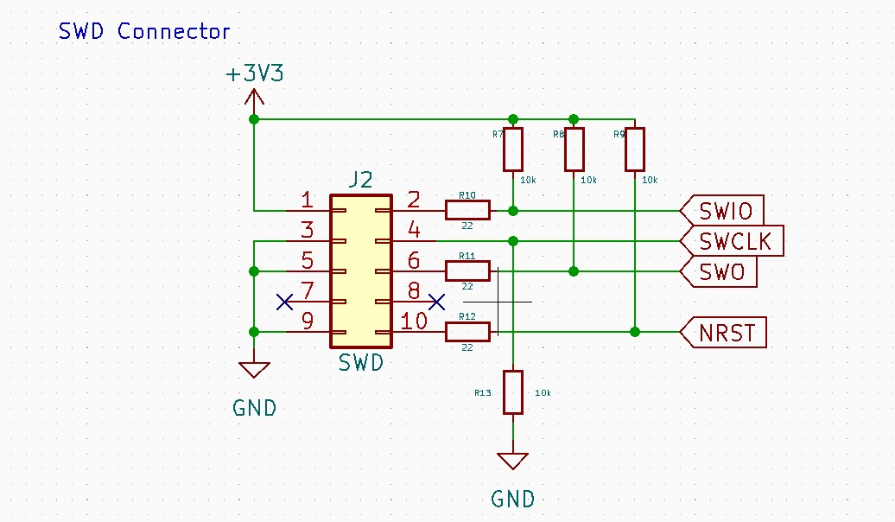

# STM32F405RGT6 Development Board KiCAD Design Files

## Introduction
This repository contains a development board for STM32F405RGT6 microcontroller.

## Circuit Schematic

## PCB and 3D View

    
    

## Microcontroller

## Buck Converter and SWD Interface

    
    

